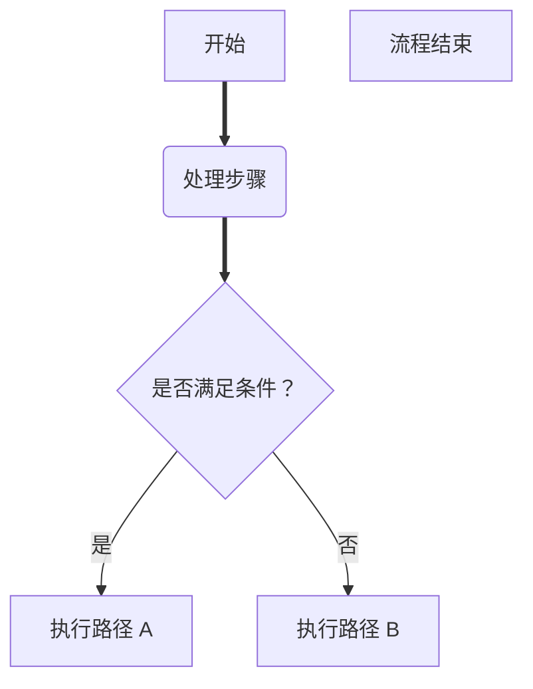

## 🛠一. 使用的软件


> 💡 **软件版本说明**：
>
> - 使用软件：**Typora v1.9.5**
> - 破解方法：推荐参考以下教程（由 CSDN 博主整理）
>
> 🔗 [https://blog.csdn.net/qq_61621323/article/details/141036982](https://blog.csdn.net/qq_61621323/article/details/141036982)

## 🔗 上期内容 & 项目地址

> 📚 **上期推荐阅读**：  
> 👉 [Markdown 结合 Typora 基础使用（1）](https://blog.csdn.net/2302_77872181/article/details/149306936?spm=1001.2014.3001.5502)

> 💻 **GitHub 源码仓库**：  
> 👉 [https://github.com/MiachelZyc/Markdown](https://github.com/MiachelZyc/Markdown)
> 👉本章对应markdown2.md

🌟 **如果你觉得本项目对你有帮助**，欢迎一键 `⭐Star` 支持，让更多人受益！

---
## 📚二. markdown 笔记用法（2）
### 1. 脚注

#### ① 功能说明

>* 脚注可用于对正文中的术语或语句提供补充信息；
>* 不影响主段落的阅读流畅性，常见于学术注释、资料出处、扩展说明等。

#### ② 基本语法

> 示例代码：
> ```text
> 这是一个Unity游戏[^①]
>
> [^①]: 一种基于VR的游戏。
> ```

#### ③ 实际效果

这是一个Unity游戏[^①]
请下滑到本页最下面，即可看见效果。

[^①]: 一种基于VR的游戏。


#### ④ 使用要点

- 使用 `[^标识]` 在正文中插入脚注位置；
- 在文末添加 `[标识]: 内容` 对应解释说明；
- 脚注标识符可为数字、字母或自定义字符串（如：`[^1]`、`[^note]`、`[^代码框架]`）；
- Typora 会自动渲染为编号格式，并支持点击跳转至脚注内容。


> 💡 **小贴士**：脚注适合简短说明，避免放入过长内容或复杂段落，以免干扰整体文档结构。
---
### 2. 链接

#### ① 使用说明

>* Markdown 支持插入超链接，适用于跳转网页、项目仓库、外部文档等；
>* 可使用裸链接、自定义文本链接，或带标题的提示链接。

#### ② 语法格式

> 示例代码：
> ```text
> https://github.com/MiachelZyc/Markdown
> [我的 GitHub 仓库](https://github.com/MiachelZyc/Markdown)
> [我的 GitHub 仓库](https://github.com/MiachelZyc/Markdown "点击访问项目主页")
> ```

#### ③ 显示效果

https://github.com/MiachelZyc/Markdown  
[我的 GitHub 仓库](https://github.com/MiachelZyc/Markdown)  
[我的 GitHub 仓库](https://github.com/MiachelZyc/Markdown "点击访问项目主页")


#### ④ 快捷键操作

> 在 Typora 中使用 `Ctrl + K` 快速插入链接。  
> 选中文本 → 按 `Ctrl + K` → 输入网址，即可生成 `[文本](链接)` 格式。
---
### 3. 图片插入

#### ① 基本语法

>* 插入图片的语法格式如下：
> ```text
>
> ```
>* 替代文字在图片无法显示时会替代出现；
>* 图片标题在部分渲染器中会在鼠标悬停时显示提示文字。
#### ② 示例代码


---
### 4. 表格

#### ① 基本语法

>* 表格使用竖线 `|` 分隔单元格；
>* 第二行使用 `:` 和 `-` 设置**对齐方式**：
>   - `:---` 左对齐  
>   - `:--:` 居中对齐  
>   - `---:` 右对齐


#### ② 示例代码

> ```text
> |  1   |  2   |  3   |
> | :--- | :--: | ---: |
> |  4   |  5   |  6   |
> |  7   |  8   |  9   |
> | 10   | 11   | 12   |
> ```


#### ③ 显示效果

| 1    |  2   |   3  |
|:---- |:---:| ----:|
| 4    |  5   |  6  |
| 7    |  8   |  9  |
| 10   | 11   | 12  |


#### ④ 快捷键（Typora）

> 在 Typora 中插入表格的快捷键为：  
> `Ctrl + T`  
> 也可通过顶部菜单 `表格 → 插入表格` 自定义行列数。

---

#### ⑤ 使用建议

- ✅ 表格适合展示结构化数据，如对比信息、参数配置、对照表等；
- ✅ 使用 `:` 控制对齐方向可增强可读性；
- ✅ 表头与内容行数不固定，可自由扩展；
- ❌ 表格不支持合并单元格（需使用 HTML 实现）；
- ❌ 表格内容过长时建议控制列数，避免排版混乱。

> 💡 **小贴士**：需要更复杂表格（如跨行、嵌套表格）时，可以考虑直接使用 HTML 语法写入 Markdown 中。

---
### 5、流程图
#### ①横向流程图

> 💡 **用途说明**：使用 Mermaid 的 `graph LR` 语法，可绘制**从左到右**的流程图，适用于展示线性流程、判断逻辑或步骤执行顺序。


> 📄 **代码示例**：
> ````text
> ```mermaid
> graph LR
> A[开始] --> B(处理步骤)
> B --> C{是否满足条件？}
> C -- 是 --> D[执行路径 A]
> C -- 否 --> E[执行路径 B]
> F[流程结束]
> ```
> ````

---

>  **效果预览（Typora 渲染图）**：


> ✅ **语法说明**：
> - `graph LR`：表示图形布局方向为从左到右（Left → Right）；
> - `[]`：表示方形节点；`()`：圆角节点；`{}`：表示判断条件；
> - `-->`：表示箭头连接；`-- 条件 -->` 可用于条件判断分支。

---

> ✨ **小贴士**：  
> 在 Typora 中渲染 Mermaid 图时，请确保「偏好设置 → Markdown → 图表与流程图」中已启用 Mermaid 支持。
#### ② 竖向流程图

> 💡 **用途说明**：使用 Mermaid 的 `graph TD` 语法可绘制**从上到下**的流程图，适合展示纵向结构或分支决策链。

---

> 📄 **代码示例**：
> ````text
> ```mermaid
> graph TD
> A[开始] ==> B(处理步骤)
> B ==> C{是否满足条件？}
> C -- 是 --> D[执行路径 A]
> C -- 否 --> E[执行路径 B]
> F[流程结束]
> ```
> ````

---

>  **渲染效果（Typora 可视预览）**：



### 6. 表情符号

#### ① 使用说明

>* Markdown 可通过 `:关键词:` 形式插入 Emoji 表情；
>* 然而并非所有 Markdown 编辑器都原生支持该语法（如 Typora 默认不支持），但 GitHub、Gitee、部分博客平台通常支持渲染；
>* 若无法识别，可直接复制 Emoji 表情符号本体使用。

---

#### ② 常见写法

> 代码示例：
> ```text
> :smile:、:cry:、:man:、:rocket:、:heart:
> ```

> 显示效果（平台支持时）：
> :smile:、:cry:、:man:、:rocket:、:heart:

---

#### ③ 推荐替代方法

如果你的平台不支持 `:关键词:` 表情语法，可直接使用 Emoji 表情符号：

> 示例：😄 😂 🚀 ❤️ 👨‍💻

---

#### ④ Emoji 表情资源网站推荐

- 🌐 [Emoji Cheat Sheet (GitHub 支持)](https://www.webfx.com/tools/emoji-cheat-sheet/)
- 📙 [Unicode Emoji List](https://unicode.org/emoji/charts/full-emoji-list.html)
- 🎨 [GetEmoji（在线复制粘贴）](https://getemoji.com/)

---

> 💡 **小贴士**：  
> 适量使用 Emoji 表情可以增加内容趣味性，但应避免在正式技术文档中大量堆叠，保持专业与简洁。
> 
---
### 7. 支持的 HTML 元素

Markdown 本身语法有限，但多数渲染器（如 Typora、GitHub）支持直接嵌入部分 HTML 元素，从而实现更多样式控制。本节列出常见可用的 HTML 标签及效果。

#### ① 文本居中

> 📄 代码示例：
> ```text
> <center>内容</center>
> ```
> 显示效果：
><center>内容</center>

---

#### ② 快捷键显示（键盘样式）

> 📄 代码示例：
> ```text
> <kbd>Ctrl + S</kbd>
> ```
> 🖼 显示效果：
<kbd>Ctrl + S</kbd>

---

#### ③ 加粗文本

> 📄 代码示例：
> ```text
> <b>加粗</b>
> ```
> 🖼 显示效果：
<b>加粗</b>

---

#### ④ 倾斜文本

> 📄 代码示例：
> ```text
> <i>倾斜</i>
> ```
> 🖼 显示效果：
><i>倾斜</i>

---

#### ⑤ 上标与下标

> 📄 代码示例：
> ```text
> 开始<sup>123hi你好</sup>
> 开始<sub>321hi你好</sub>
> ```
> 显示效果：
>开始<sup>123hi你好</sup>  
>开始<sub>321hi你好</sub>

---

#### ⑥ 黑色箭头（特殊符号）

> 📄 代码示例：
> ```text
> &#x27A4;
> ```
>  显示效果：
> &#x27A4;


> 💡 **小贴士**：  
> 使用 HTML 标签可以扩展 Markdown 的表现力，但应适度使用，确保文档可读性与兼容性。部分平台（如微信公众号）可能不支持部分标签渲染。
>
> 
